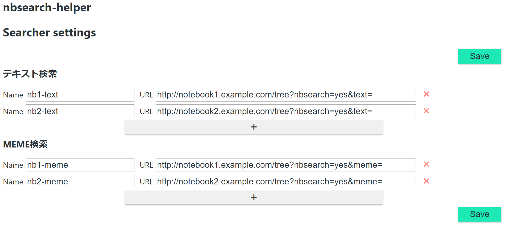
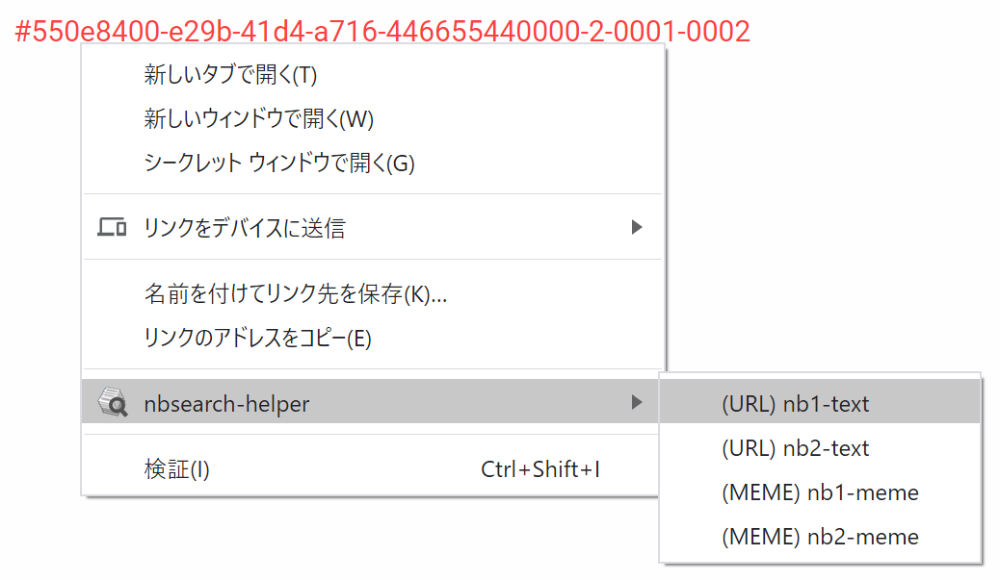

# nbsearch-helper
nbsearch-helperは[nbsearch](https://github.com/NII-cloud-operation/nbserach)のためのChrome Extensionです。
[Scrapbox](https://scrapbox.io/)や[Jupyter Notebook](https://github.com/jupyter/notebook)から、テキストやMEMEを素早くnbsearchで検索するためのUIを提供します。

## Prerequisite
- Jupyter Notebook 4.2.x or 5.x
- [nbsearch](https://github.com/NII-cloud-operation/nbserach) Extension is installed and enabled
- [nblineage Extension](https://github.com/NII-cloud-operation/Jupyter-LC_nblineage) is installed and enabled (Optional)
- [sidestickies Extension](https://github.com/NII-cloud-operation/sidestickies) is installed and enabled (Optional)

## Install
chrome://extensions/ を開き、「パッケージ化されていない拡張機能を読み込む」からこのリポジトリの`src/`ディレクトリを指定しインストールします。

## Usage

### Settings
検索エンジンは「テキスト検索」と「MEME検索」の2種類あります。オプションページで、それぞれの検索エンジンを設定します。

`Name`には任意の名前を設定できます。`URL`には検索するときに用いるURLを設定します。例えばURLに`http://notebook1.example.com/tree?nbsearch=yes&meme=`を設定すると、検索URLは`http://notebook1.example.com/tree?nbsearch=yes&meme=XXXXXXXX-XXXX-XXXX-XXXX-XXXXXXXXXXXX`のようになります。

### Search
nbsearch-helperは、「選択テキスト」、「リンク」、「Jupyter Notebook上のCell」の3種類の場所から検索することができます。
これらのいずれかの場所を右クリックしてコンテキストメニューを開き、検索エンジンを選択することで、指定したMEMEやテキストで検索します。

どこで何を右クリックしたかによって、表示されるメニューアイテムが変わります。メニューアイテムのプレフィックスの意味は以下の通りです。

| Prefix | 意味 |
|:---:|:---|
| (as Text) | 選択したテキストを検索します。選択したテキストを右クリックした場合に表示されます。 |
| (as MEME) | 選択したテキストをMEMEとして検索します。選択したテキストを右クリックし、かつ、それがMEMEらしい文字列の場合のみ、表示されます。 |
| (URL) | リンクのURLをテキストとして検索します。リンクを右クリックした場合に表示されます。 |
| (MEME) | リンクのURLをMEMEとして検索します。リンクを右クリックした場合に表示されます。主に、**Scarapbox上のMEMEのハッシュタグに対して有効**です。 |
| (Cell MEME) | **Jupyter Notebook上のCell**を右クリックした場合に表示されます。nblineageにより付与されたCellのMEMEで検索します。 |
